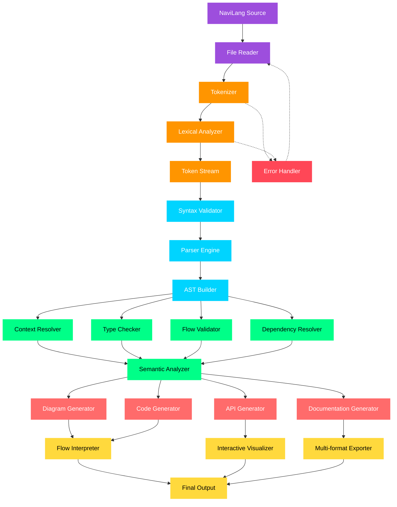
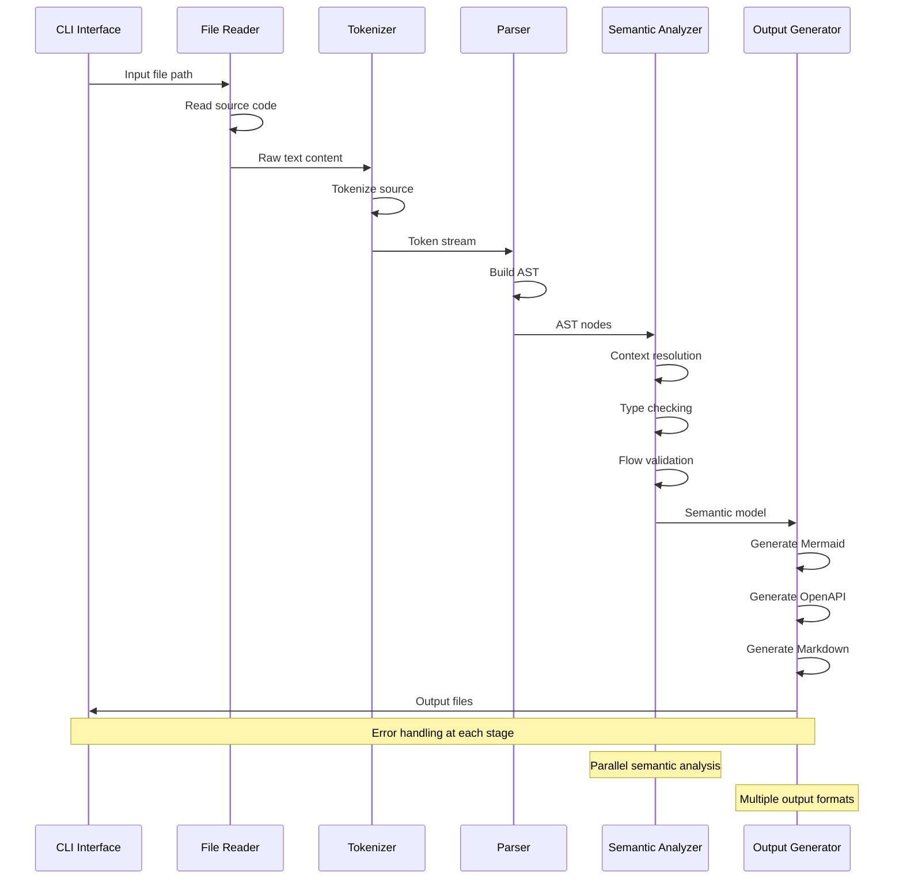
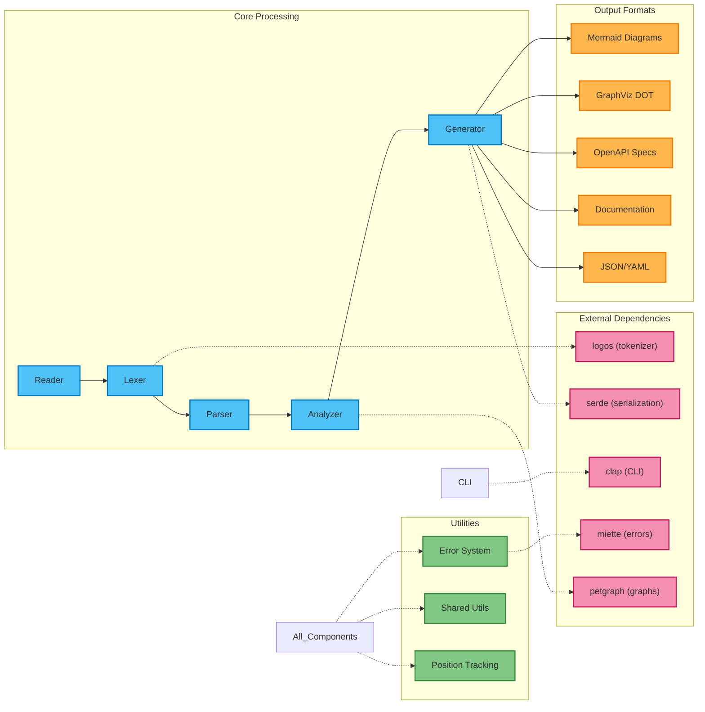
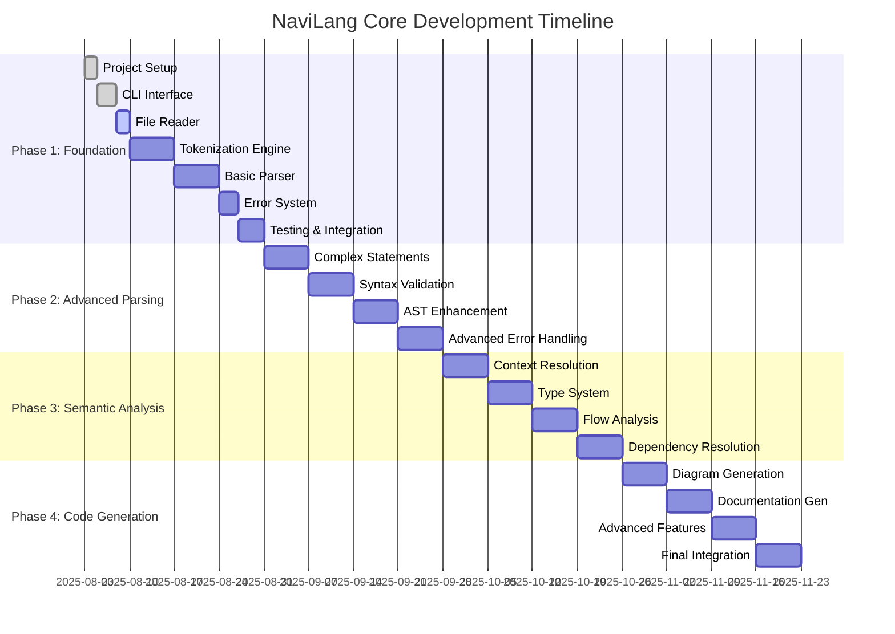
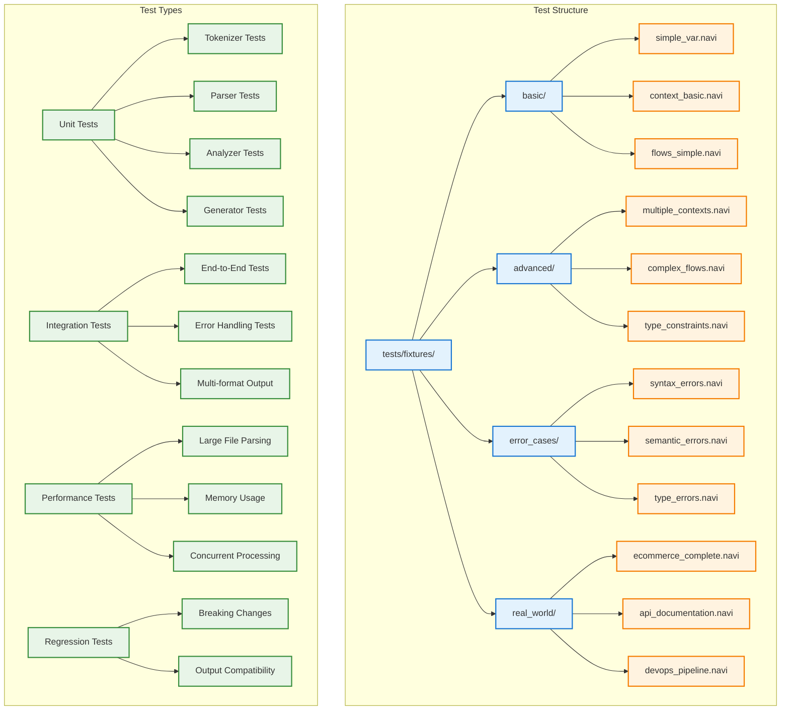

# NaviLang Core Compiler - Product Requirements Document (PRD)

## 🎯 Executive Summary

**Project**: NaviLang Core Compiler  
**Language**: Rust  
**Objective**: Build a robust, performant compiler for NaviLang that transforms declarative flow descriptions into multiple output formats (diagrams, APIs, documentation, code).

**Timeline**: 12-16 weeks (4 development phases)  
**Target Users**: Developers, Technical Writers, System Architects, DevOps Engineers

## 🔍 Problem Statement

Current workflow documentation and system modeling tools lack:
- **Simplicity**: Complex syntax barriers for non-technical users
- **Interoperability**: Limited export formats and integration capabilities  
- **Context Isolation**: No proper scoping for large, distributed systems
- **Real-time Collaboration**: Static documentation that becomes outdated
- **Multi-format Output**: Single-purpose tools that don't scale

NaviLang solves these by providing a natural language-like syntax that compiles to multiple visualization and documentation formats.

## 🏗️ Architecture Overview

Based on the provided flowchart, our compiler follows this pipeline:



### Data Flow Architecture



### Component Dependencies



## 📋 Core Requirements

### Functional Requirements

#### 1. Language Processing
- **FR-1**: Parse NaviLang syntax according to BNF grammar specification
- **FR-2**: Support all core keywords (VAR, GOES TO, CONTEXT, IF/THEN, etc.)
- **FR-3**: Handle advanced keywords (RETRY, TIMEOUT, ASYNC, PARALLEL, etc.)
- **FR-4**: Validate syntax and provide meaningful error messages
- **FR-5**: Build Abstract Syntax Tree (AST) representation

#### 2. Semantic Analysis
- **FR-6**: Resolve context scoping and prevent naming conflicts
- **FR-7**: Perform type checking for entities, services, and constraints
- **FR-8**: Validate flow logic (detect dead ends, infinite loops)
- **FR-9**: Resolve dependencies and execution order

#### 3. Output Generation
- **FR-10**: Generate Mermaid flowchart diagrams
- **FR-11**: Export to GraphViz DOT format
- **FR-12**: Produce OpenAPI/Swagger specifications
- **FR-13**: Generate Markdown documentation
- **FR-14**: Create JSON/YAML structured output
- **FR-15**: Support PlantUML export
- **FR-16**: Generate executable code templates

#### 4. Error Handling
- **FR-17**: Provide precise error locations with line/column numbers
- **FR-18**: Offer helpful error messages and suggestions
- **FR-19**: Support error recovery for batch processing
- **FR-20**: Validate cross-context references

### Non-Functional Requirements

#### Performance
- **NFR-1**: Parse files up to 10MB in under 2 seconds
- **NFR-2**: Support concurrent processing of multiple contexts
- **NFR-3**: Memory usage under 100MB for typical workloads

#### Reliability
- **NFR-4**: 99.9% success rate on valid NaviLang code
- **NFR-5**: Graceful degradation for partial syntax errors
- **NFR-6**: Comprehensive test coverage (>90%)

#### Usability
- **NFR-7**: Clear, actionable error messages
- **NFR-8**: Support for multiple input formats (.navi, .txt, stdin)
- **NFR-9**: Configurable output options and formatting

## 🚀 Development Phases

### Development Timeline



### Phase 1: Foundation (Weeks 1-4)
**Goal**: Basic tokenization and parsing infrastructure

#### Milestone 1.1: Project Setup
- [ ] Initialize Rust project with proper structure
- [ ] Set up development dependencies and tools
- [ ] Create basic CLI interface
- [ ] Implement file reading functionality

#### Milestone 1.2: Tokenization Engine
- [ ] Define Token enum with all NaviLang keywords
- [ ] Implement lexical analyzer using `logos` crate
- [ ] Handle identifiers, quoted strings, and symbols
- [ ] Add position tracking for error reporting

#### Milestone 1.3: Basic Parser
- [ ] Define AST node structures
- [ ] Implement recursive descent parser
- [ ] Parse simple statements (VAR, GOES TO, etc.)
- [ ] Handle basic error cases

**Deliverables**:
- Working tokenizer for all NaviLang keywords
- Basic AST generation for simple statements
- CLI tool that can parse and display tokens

### Phase 2: Advanced Parsing (Weeks 5-8)
**Goal**: Complete parser with full syntax support

#### Milestone 2.1: Complex Statements
- [ ] Parse CONTEXT blocks with nested statements
- [ ] Handle conditional statements (IF/THEN)
- [ ] Support event triggers (WHEN/THEN)
- [ ] Implement advanced keywords (PARALLEL, RETRY, etc.)

#### Milestone 2.2: Syntax Validation
- [ ] Implement comprehensive syntax checker
- [ ] Add grammar validation according to BNF specification
- [ ] Create detailed error reporting system
- [ ] Support error recovery mechanisms

#### Milestone 2.3: AST Enhancement
- [ ] Complete AST node definitions
- [ ] Add metadata (positions, types, annotations)
- [ ] Implement AST traversal utilities
- [ ] Create AST pretty-printer for debugging

**Deliverables**:
- Complete parser supporting all NaviLang syntax
- Robust error handling with precise locations
- AST representation ready for semantic analysis

### Phase 3: Semantic Analysis (Weeks 9-12)
**Goal**: Type checking, flow validation, and dependency resolution

#### Milestone 3.1: Context Resolution
- [ ] Implement context scoping system
- [ ] Detect naming conflicts across contexts
- [ ] Support cross-context references
- [ ] Validate context isolation rules

#### Milestone 3.2: Type System
- [ ] Define type system for entities, services, etc.
- [ ] Implement type checker with constraint validation
- [ ] Support enum types and validation
- [ ] Handle type coercion and compatibility

#### Milestone 3.3: Flow Analysis
- [ ] Detect unreachable code and dead ends
- [ ] Validate flow logic and transitions
- [ ] Check for infinite loops and cycles
- [ ] Analyze dependency chains

**Deliverables**:
- Semantic analyzer with full type checking
- Flow validation preventing logical errors
- Dependency resolution for execution ordering

### Phase 4: Code Generation (Weeks 13-16)
**Goal**: Multiple output format generation

#### Milestone 4.1: Diagram Generation
- [ ] Implement Mermaid flowchart generator
- [ ] Create GraphViz DOT output
- [ ] Generate PlantUML diagrams
- [ ] Support visual annotations and styling

#### Milestone 4.2: Documentation Generation
- [ ] Generate Markdown documentation
- [ ] Create HTML output with embedded diagrams
- [ ] Support OpenAPI/Swagger specification
- [ ] Generate PDF reports

#### Milestone 4.3: Advanced Features
- [ ] Code template generation
- [ ] JSON/YAML structured export
- [ ] Interactive visualization data
- [ ] Plugin system for custom generators

**Deliverables**:
- Multi-format output generation
- Production-ready CLI tool
- Comprehensive documentation and examples

## 🛠️ Technical Implementation

### Project Structure

```mermaid
graph TD
    ROOT["navilang-core/"]
    ROOT --> CARGO["Cargo.toml"]
    ROOT --> SRC["src/"]
    ROOT --> TESTS["tests/"]
    ROOT --> EXAMPLES["examples/"]
    
    SRC --> MAIN["main.rs - CLI entry point"]
    SRC --> LIB["lib.rs - Public API"]
    SRC --> READER["reader/ - File I/O"]
    SRC --> LEXER["lexer/ - Tokenization"]
    SRC --> PARSER["parser/ - AST Building"]
    SRC --> ANALYZER["analyzer/ - Semantic Analysis"]
    SRC --> GENERATOR["generator/ - Output Generation"]
    SRC --> ERROR["error/ - Error Handling"]
    SRC --> UTILS["utils/ - Shared Utilities"]
    
    LEXER --> LEX_MOD["mod.rs"]
    LEXER --> LEX_TOKENS["tokens.rs"]
    
    PARSER --> PARSE_MOD["mod.rs"]
    PARSER --> PARSE_AST["ast.rs"]
    PARSER --> PARSE_GRAM["grammar.rs"]
    
    ANALYZER --> ANA_MOD["mod.rs"]
    ANALYZER --> ANA_CTX["context.rs"]
    ANALYZER --> ANA_TYPES["types.rs"]
    ANALYZER --> ANA_FLOW["flow.rs"]
    ANALYZER --> ANA_DEP["dependencies.rs"]
    
    GENERATOR --> GEN_MOD["mod.rs"]
    GENERATOR --> GEN_MERM["mermaid.rs"]
    GENERATOR --> GEN_DOT["graphviz.rs"]
    GENERATOR --> GEN_API["openapi.rs"]
    GENERATOR --> GEN_MD["markdown.rs"]
    GENERATOR --> GEN_JSON["json.rs"]
    
    TESTS --> INT["integration/"]
    TESTS --> FIX["fixtures/"]
    TESTS --> SNAP["snapshots/"]
    
    EXAMPLES --> EX_BASIC["basic.navi"]
    EXAMPLES --> EX_ECOM["ecommerce.navi"]
    EXAMPLES --> EX_DEV["devops.navi"]
    
    classDef folder fill:#e1f5fe,stroke:#01579b,stroke-width:2px
    classDef rustfile fill:#fff3e0,stroke:#e65100,stroke-width:2px
    classDef navifile fill:#f3e5f5,stroke:#4a148c,stroke-width:2px
    classDef configfile fill:#e8f5e8,stroke:#1b5e20,stroke-width:2px
    
    class ROOT,SRC,TESTS,EXAMPLES,READER,LEXER,PARSER,ANALYZER,GENERATOR,ERROR,UTILS,INT,FIX,SNAP folder
    class MAIN,LIB,LEX_MOD,LEX_TOKENS,PARSE_MOD,PARSE_AST,PARSE_GRAM,ANA_MOD,ANA_CTX,ANA_TYPES,ANA_FLOW,ANA_DEP,GEN_MOD,GEN_MERM,GEN_DOT,GEN_API,GEN_MD,GEN_JSON rustfile
    class EX_BASIC,EX_ECOM,EX_DEV navifile
    class CARGO configfile
```


### Key Dependencies
```toml
[dependencies]
logos = "0.13"              # Fast tokenizer generator
serde = { version = "1.0", features = ["derive"] }
serde_json = "1.0"         # JSON serialization
serde_yaml = "0.9"         # YAML serialization
clap = { version = "4.0", features = ["derive"] }  # CLI framework
anyhow = "1.0"             # Error handling
thiserror = "1.0"          # Custom error types
petgraph = "0.6"           # Graph data structures
miette = { version = "5.0", features = ["fancy"] }  # Error reporting

[dev-dependencies]
insta = "1.0"              # Snapshot testing
criterion = "0.5"          # Benchmarking
tempfile = "3.0"           # Temporary files for tests
```

### Core Data Structures

```rust
// AST Node Types
#[derive(Debug, Clone, PartialEq)]
pub enum ASTNode {
    Program { contexts: Vec<Context> },
    Context { name: String, statements: Vec<Statement> },
    Statement(StatementKind),
}

#[derive(Debug, Clone, PartialEq)]
pub enum StatementKind {
    VarDeclaration { name: String, type_info: Option<TypeInfo> },
    Transition { from: String, to: String },
    Creation { entity: String, creator: String },
    Action { subject: String, action: String, object: Option<String> },
    Conditional { condition: Condition, then_stmt: Box<Statement> },
    Event { trigger: Condition, action: Box<Statement> },
    // ... other statement types
}

// Type System
#[derive(Debug, Clone, PartialEq)]
pub enum TypeInfo {
    Entity,
    Service,
    Endpoint,
    Custom(String),
    Enum { variants: Vec<String> },
    Constrained { base_type: Box<TypeInfo>, constraints: Vec<Constraint> },
}

// Semantic Analysis Results
#[derive(Debug)]
pub struct SemanticModel {
    pub contexts: HashMap<String, ContextModel>,
    pub dependencies: DependencyGraph,
    pub type_bindings: HashMap<String, TypeInfo>,
    pub flow_graph: FlowGraph,
}
```

## 🧪 Testing Strategy

### Unit Tests
- **Tokenizer**: Test all keywords, identifiers, and edge cases
- **Parser**: Test each statement type and error conditions
- **Semantic Analysis**: Test type checking, context resolution, flow validation
- **Generators**: Test output format correctness

### Integration Tests
- **End-to-End**: Complete NaviLang files to output formats
- **Error Handling**: Invalid syntax and semantic errors
- **Performance**: Large files and complex contexts
- **Regression**: Prevent breaking changes

### Test Files


## 📊 Success Metrics

### Development Metrics
- **Code Coverage**: >90% test coverage
- **Performance**: Parse 1000-line files in <500ms
- **Memory**: <50MB memory usage for typical workloads
- **Error Quality**: >95% of errors provide actionable feedback

### User Experience Metrics
- **Syntax Errors**: <5% false positives in error reporting
- **Output Quality**: Generated diagrams match semantic intent
- **Documentation**: API docs generated match actual implementations
- **Adoption**: Enable 10+ real-world use cases

## 🚨 Risk Assessment

### Risk Matrix

```mermaid
graph TD
    subgraph "Impact vs Probability Matrix"
        A[High Impact, Low Probability]
        B[High Impact, Medium Probability]
        C[High Impact, High Probability]
        D[Medium Impact, Low Probability]
        E[Medium Impact, Medium Probability]
        F[Medium Impact, High Probability]
        G[Low Impact, Low Probability]
        H[Low Impact, Medium Probability]
        I[Low Impact, High Probability]
    end
    
    subgraph "Technical Risks"
        T1["Complex Grammar Parsing"]
        T2["Performance with Large Files"]
        T3["Output Format Compatibility"]
        
        T1 --> B
        T2 --> E
        T3 --> D
    end
    
    subgraph "Project Risks"
        P1["Scope Creep"]
        P2["Resource Constraints"]
        P3["Changing Requirements"]
        
        P1 --> B
        P2 --> D
        P3 --> E
    end
    
    subgraph "Mitigation Strategies"
        M1["Proven Parsing Libraries"]
        M2["Incremental Parsing"]
        M3["Standard Tool Validation"]
        M4["Strict Phase Boundaries"]
        M5["Modular Development"]
        M6["Agile Development"]
        
        T1 -.-> M1
        T2 -.-> M2
        T3 -.-> M3
        P1 -.-> M4
        P2 -.-> M5
        P3 -.-> M6
    end
    
    classDef highrisk fill:#ff5722,stroke:#d32f2f,stroke-width:2px,color:#fff
    classDef mediumrisk fill:#ff9800,stroke:#f57c00,stroke-width:2px,color:#fff
    classDef lowrisk fill:#4caf50,stroke:#388e3c,stroke-width:2px,color:#fff
    classDef mitigation fill:#2196f3,stroke:#1976d2,stroke-width:2px,color:#fff
    
    class C,F,I highrisk
    class B,E,H mediumrisk
    class A,D,G lowrisk
    class M1,M2,M3,M4,M5,M6 mitigation
```



### Technical Risks
| Risk | Impact | Probability | Mitigation |
|------|---------|-------------|------------|
| Complex grammar parsing | High | Medium | Use proven parsing libraries, extensive testing |
| Performance with large files | Medium | Medium | Incremental parsing, memory optimization |
| Output format compatibility | Medium | Low | Validate against standard tools |

### Project Risks
| Risk | Impact | Probability | Mitigation |
|------|---------|-------------|------------|
| Scope creep | High | Medium | Strict phase boundaries, MVP focus |
| Resource constraints | Medium | Low | Modular development, community contributions |
| Changing requirements | Medium | Medium | Agile development, regular stakeholder feedback |

## 🎯 Future Roadmap (Post-MVP)

### Phase 5: Advanced Features
- **Visual Editor Integration**: WebAssembly compilation for browser use
- **Language Server Protocol**: IDE integration with syntax highlighting
- **Real-time Collaboration**: Multi-user editing capabilities
- **Plugin System**: Custom generators and analyzers

### Phase 6: Ecosystem
- **CI/CD Integration**: GitHub Actions, GitLab CI support
- **Cloud Platform**: SaaS version with collaborative features
- **Enterprise Features**: Advanced security, audit trails
- **AI Integration**: GPT-assisted flow generation

## 📚 References

- [NaviLang Overview Documentation](./Overview.md)
- [BNF Grammar Specification](./grammar.md)
- [Rust Language Reference](https://doc.rust-lang.org/reference/)
- [logos Tokenizer Documentation](https://docs.rs/logos/)
- [Mermaid Diagram Syntax](https://mermaid-js.github.io/mermaid/)

---

**Last Updated**: August 3, 2025  
**Version**: 1.0  
**Status**: Ready for Development
