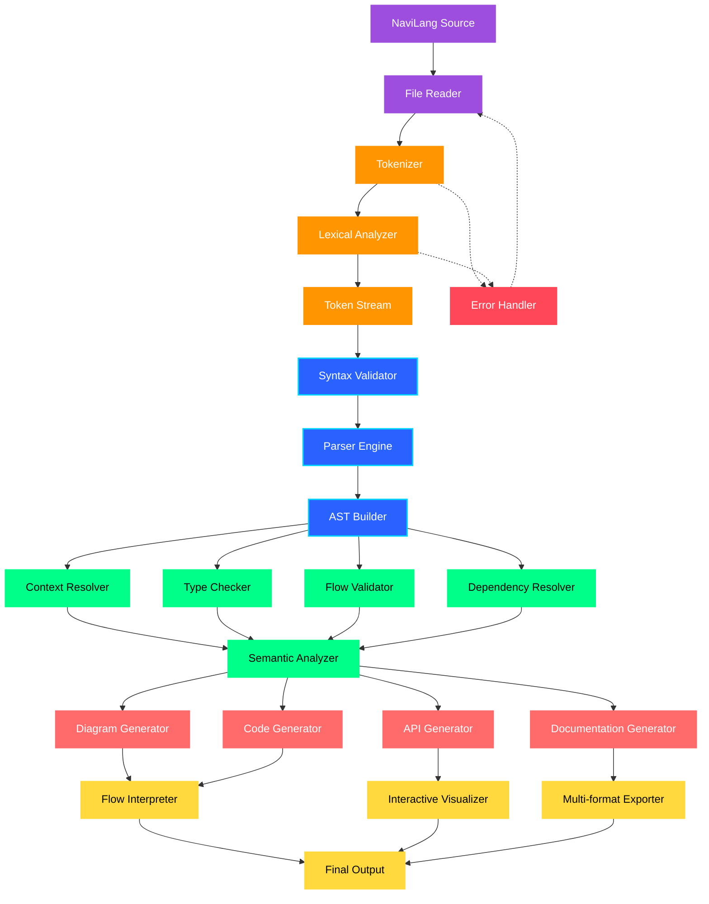
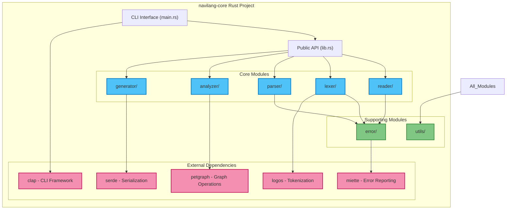
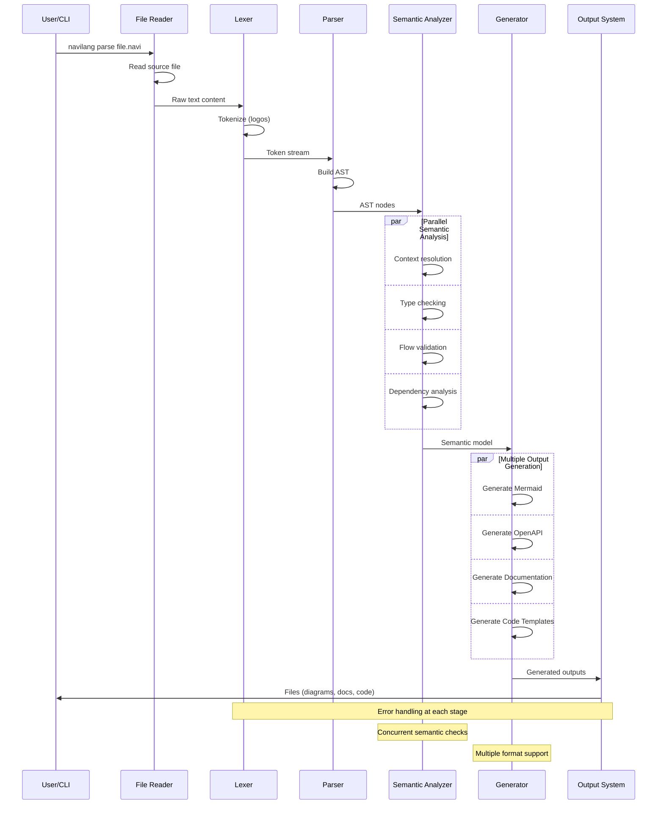

# NaviLang Core Architecture

## 🏗️ System Overview

The NaviLang compiler follows a traditional multi-stage compilation pipeline, transforming human-readable declarative flow descriptions into multiple output formats including diagrams, documentation, and executable code.

## 📊 Main Architecture Pipeline



## 🔍 Pipeline Stages Detailed

### 1. Input Stage (Purple)
- **NaviLang Source**: Raw .navi files containing declarative flow descriptions
- **File Reader**: Handles file I/O, supports multiple input formats (.navi, .txt, stdin)

### 2. Lexical Analysis Stage (Orange)
- **Tokenizer**: Breaks source text into tokens using the `logos` crate
- **Lexical Analyzer**: Validates tokens and handles lexical errors
- **Token Stream**: Structured sequence of validated tokens

### 3. Syntax Analysis Stage (Blue)
- **Syntax Validator**: Ensures token sequences follow NaviLang grammar
- **Parser Engine**: Recursive descent parser implementing BNF grammar
- **AST Builder**: Constructs Abstract Syntax Tree representation

### 4. Semantic Analysis Stage (Green)
- **Context Resolver**: Manages isolated contexts and scoping rules
- **Type Checker**: Validates entity types, constraints, and compatibility
- **Flow Validator**: Detects dead ends, infinite loops, and logical errors
- **Dependency Resolver**: Analyzes execution order and dependencies
- **Semantic Analyzer**: Orchestrates all semantic checks and builds semantic model

### 5. Code Generation Stage (Red)
- **Diagram Generator**: Creates Mermaid, GraphViz, PlantUML outputs
- **API Generator**: Produces OpenAPI/Swagger specifications
- **Documentation Generator**: Generates Markdown, HTML, PDF documentation
- **Code Generator**: Creates executable code templates and boilerplate

### 6. Output Stage (Yellow)
- **Flow Interpreter**: Executes and simulates flows
- **Interactive Visualizer**: Provides real-time visualization capabilities
- **Multi-format Exporter**: Handles various output formats and targets
- **Final Output**: Unified output delivery system

### 7. Error Handling (Red)
- **Error Handler**: Global error management with recovery mechanisms
- Provides precise error locations and helpful suggestions
- Supports graceful degradation for batch processing

## 🗂️ Module Architecture



## 🔄 Data Flow



## 🎯 Design Principles

### 1. **Modularity**
- Each stage is a separate, testable module
- Clear interfaces between components
- Plugin architecture for generators

### 2. **Error-First Design**
- Comprehensive error handling at every stage
- Precise error locations with helpful suggestions
- Graceful degradation for partial failures

### 3. **Performance**
- Parallel semantic analysis where possible
- Incremental parsing for large files
- Memory-efficient AST representation

### 4. **Extensibility**
- Plugin system for custom output generators
- Support for new keywords and syntax extensions
- Modular generator architecture

### 5. **Type Safety**
- Strong typing throughout Rust implementation
- Compile-time guarantees for correctness
- Safe memory management

## 🧩 Core Data Structures

### AST Representation
```rust
pub enum ASTNode {
    Program { contexts: Vec<Context> },
    Context { name: String, statements: Vec<Statement> },
    Statement { kind: StatementKind, span: Span },
}

pub enum StatementKind {
    VarDeclaration { name: String, type_info: Option<TypeInfo> },
    Transition { from: String, to: String },
    Action { subject: String, action: String, object: Option<String> },
    Conditional { condition: Condition, then_stmt: Box<Statement> },
    // ... other statement types
}
```

### Semantic Model
```rust
pub struct SemanticModel {
    pub contexts: HashMap<String, ContextModel>,
    pub dependencies: DependencyGraph,
    pub type_bindings: HashMap<String, TypeInfo>,
    pub flow_graph: FlowGraph,
}
```

### Error Types
```rust
pub enum NaviLangError {
    SyntaxError { message: String, span: SourceSpan },
    SemanticError { message: String, span: SourceSpan },
    TypeError { expected: String, found: String, span: SourceSpan },
    IoError(std::io::Error),
}
```

## 🚀 Implementation Strategy

### Phase 1: Foundation (Weeks 1-4)
- Basic CLI and file reading
- Complete tokenizer with error handling
- Simple parser for basic statements
- AST representation

### Phase 2: Advanced Parsing (Weeks 5-8)
- Complex statement parsing (contexts, conditionals)
- Enhanced error reporting
- Complete AST with metadata

### Phase 3: Semantic Analysis (Weeks 9-12)
- Context resolution and type checking
- Flow validation and dependency analysis
- Semantic model construction

### Phase 4: Code Generation (Weeks 13-16)
- Multiple output format generators
- Documentation and diagram generation
- Integration and optimization

## 📋 Quality Assurance

### Testing Strategy
- **Unit Tests**: Each module thoroughly tested
- **Integration Tests**: End-to-end compilation pipeline
- **Performance Tests**: Large file handling and memory usage
- **Regression Tests**: Prevent breaking changes

### Error Handling
- Precise error locations with line/column numbers
- Helpful error messages with suggestions
- Error recovery for batch processing
- Comprehensive error reporting with `miette`

### Documentation
- API documentation with `rustdoc`
- Architecture documentation (this file)
- User guides and examples
- Contributing guidelines

---

**Related Documents:**
- [Product Requirements Document](../../docs/PRD_NaviLang_Core.md)
- [Development Roadmap](../../docs/Development_Roadmap_Phase1.md)
- [NaviLang Overview](./Overview.md)


